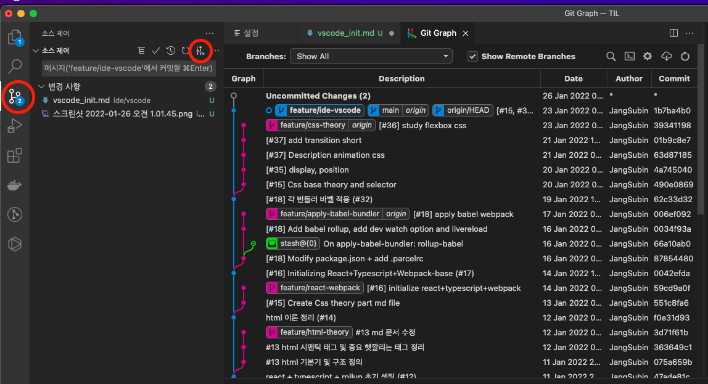
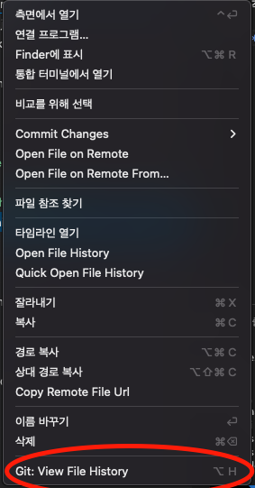
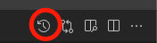
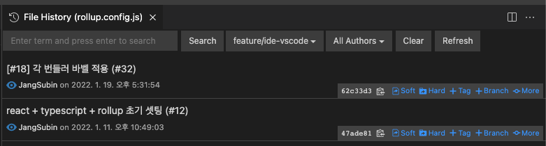
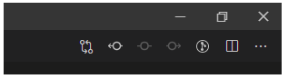
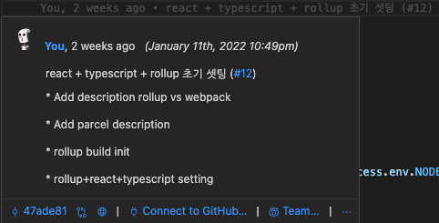
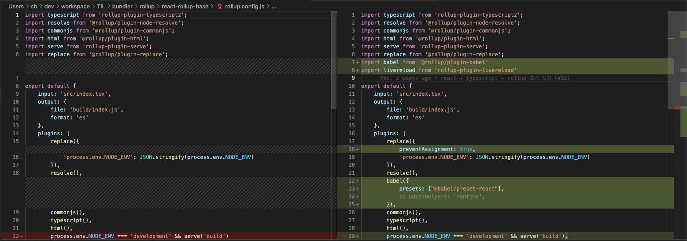

# VSCode 시작하기

Microsoft 의 **Visual Studio Code** 는 MIT 라이센스로 오픈소스 이다.  
보통 jetbrains 사의 webstorm 을 쓰던사람들은 비용이 들지 않는 이유로 많이 넘어왔던 것 같다.

## Extension(플러그인)

기본적으로 처음 시작할 때 설치 플러그인들이다.

* ESLint
* Prettier - Code formatter
* Git Graph
* Git History
* GitLens
* Tabnine
* Doxygen Documentation Generator
* Material Theme
* Material Icon Theme
* Indent Rainbow
* auto rename tag
* css peek
* HTML CSS Support
* Live Server
* Reactjs code snippets
* Auto Import

### ESLint

코드의 오류나 버그, 스타일 등을 점검하는 도구가 린트(Lint) 혹은 린터(Linter)라고 부른다.
즉, 린트는 코드의 포맷팅과 품질관리 도구이다.

### Prettier - Code formatter

Prettier 는 팀원간 소스 코드 포맷팅을 일치시킬 수 있다는 장점이 있다.

1. File > Preferences > Settings ( 키보드 command + , )
2. **Default Formatter** 검색 > **Prittier - Code formatter** 선택
3. **editor format on save** 검색 > Fomat On Save **체크**
4. **json** 검색 > Edit in setting.json 클릭 > editor.formatOnSave true 확인

> 뭔가 Prettier 가 작동을 안할 때, 해당 프로젝트에서 Prettier: Prettier Path 를 설정해줘야되는 것 같다. (*이 부분은 좀 더 확인이 필요!!*)

### Git Graph
Webstorm 의 git log 나 sourceTree 처럼 git 을 막대 형태로 볼 수 있게해주는 플러그인 이다.   
시각적으로 부담없이 볼 수 있다.    



* Git 에 대한 명령은 거의 터미널로 진행하고 있어서 시각적인 흐름을 볼 때 사용하면 좋을 것 같다.

### Git History
각 파일에 대한 깃 히스토리를 확인 할 수 있다. (해당 파일이 어느 커밋에 포함되어있는지 확인할 수 있는 것)

* 탐색기에서 파일 우클릭 후 Git: View File History 를 클릭하거나 파일 클릭 후 키보드 **option + H**   


* 우측 상단에 버튼을 클릭하거나 키보드 **option + H**   


**History 확인 가능!**   


### GitLens
개인적으로 가장 핫 꿀 플러그인 중 하나라고 생각된다.
* 상단에 GitLens 툴바가 추가된다.   

* 마우스 오버 시 해당라인의 커밋 코멘트를 알 수 있다.
    * 빠르게 커밋한 담당자(범인)를 찾아낼 수 있다.
    * 커밋메세지를 확인함으로써 해당 라인에서 바로 전에 무엇을 작업했는지 알 수 있다.   

* 뒤로 및 앞으로 버튼으로 파일 기록을 손쉽게 볼 수 있다.   
    * diff 기능으로 보고있는 버전과 그 직전버전을 diff 로 볼 수 있다.   


### Tabnine
이건 웹스톰 때부터 쓰던건데, 내가 이전에 썼던 명령어를 예측해서 code assist 해주는 플러그인 이다.   
필수적인 플러그인은 아닌 것 같지만, vscode 에도 있길래 설치해봤다.

### Doxygen Documentation Generator
주석 자동 생성기로 함수명 위에서 `/**` 엔터 치면 자동으로 생성 해준다.   
아직 사용은 안해봤지만, webstorm 에서처럼 vscode 가 주석이 이쁘게 생기는게 아니라면 상당히 도움이 되는 플러그인이 될 것 같다!!

### Material Theme
VSCode 의 여러 테마를 선택할 수 있음

### Material Icon Theme 
탐색기의 파일 아이콘이 변경됨(그냥 이쁨)

### Indent Rainbow
들여쓰기(탭) 된 부분이 하이라이트됨

### Auto Rename Tag
html 태그에서 앞에 태그를 바꾸면 뒤에 태그도 자동으로 변경된다.(웹스톰은 원래 됨..)

### CSS Peek
html 태그 에서 css class 명을 찾아가주는 플러그인 (웹스톰은 원래 됨..)

### HTML CSS Support
css class 명 코드 어시스트 기능 제공

### Live Server
hot reload 지원(저장하면 자동반영)

### Reactjs code snippets
여러 키워드를 통해 리액트 컴포넌트 초기틀 기타 등등 작성 가능 (플러그인 내 트리거 참조)

### Auto Import
자동 임포트(딱봐도 편함)

## 기타 설정

### oh-my-zsh를 사용할 때 터미널 글꼴이 깨진다면
1. "SourceCodePro+Powerline+Awesome Regular" 글꼴을 받아 설치한다. ([다운로드 링크](https://github.com/Falkor/dotfiles/raw/master/fonts/SourceCodePro%2BPowerline%2BAwesome%2BRegular.ttf))
2. Visual Studio Code 설정에서 terminal.integrated.fontFamily 항목에 'SourceCodePro+Powerline+Awesome Regular'를 넣는다. (작은 따옴표를 포함해야 한다!)
> 참고 자료 - https://gonigoni.kr/posts/vscode-oh-my-zsh/

### Auto Save
Webstorm 의 자동저장이 너무나 적응되어버렸다면 vscode 도 자동저장 설정을 할 수 있다.
1. 설정 (**command + ,**) 
2. 검색어 **auto save**
3. Files: Auto Save 선택상자에서 **onFocusChange** or **onWindowChange** 선택

### settings.json
* comment(주석) 색상 변경
    ```json
    "editor.tokenColorCustomizations": {
        "comments": "#ffc2c2"
    },
    ```

* block 단위 괄호에 색깔을 줌
    ```json
    "editor.bracketPairColorization.enabled": true,
    "editor.guides.bracketPairs": "active"
    ```

* postcss 에서 Emmet 사용을 위한 설정
    ```json
    "emmet.includeLanguages": {
        "javascript": "javascriptreact",
        "postcss": "css"
    },
    "emmet.syntaxProfiles": {
        "postcss": "css"
    },
    ```