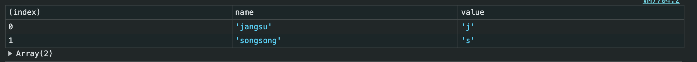

# Console

### `console.count`

- 함수나 코드가 실행된 횟수를 계산 (호출된 횟수만 기록)
- 여러개의 카운터를 사용할 수 있으며, 매개변수를 통해 라벨과 함께 `console.count` 를 호출하여 카운터 구분 가능 (ex: `console.count('jangsu')`)
- react 내에서 `console.count` 를 넣어서 실행 중인지 혹은 예상치 못한 상황에서 리렌더링 되는지 확인할 수 있음
- `console.countReset` 을 사용하여 카운트를 0으로 초기화 가능 (_마찬가지로 라벨 파라미터로 초기화 가능_)

### `console.time`

- 타이머 기능으로, 하나 또는 여러 개의 작업에 걸리는 시간을 파악
- `console.time()` 을 호출하여 타이머 시작하여, 시간을 측정하려는 코드를 실행하고, 완료되면 `console.timeEnd()` 을 호출하여 타이머를 중지하여 소요시간(밀리초) 확인
- 한 페이지에 최대 10,000개 타이머 실행 가능
- 개별 기능을 프로파일링할 때 라벨 파라미터를 통해 타이머 구분 가능

  ```js
  console.time("data");
  setData(); // 시간측정할 함수
  console.timeEnd("data");
  // data: 1111.1111 ms
  ```

- `console.timeLog` : 타이머 종료 전 어느 시점에서든지 타이머의 현재 값(시간값)을 기록 가능
- 라벨 파라미터로 그룹핑

### `console.assert`

- 작성하는 조건이 `false` 인 경우에만 콘솔에 오류 메세지 노출 (`console.assert(1 === 2)`)
- 값이 예상한 값인지 확인하기 위해 `console.log` 로 많은 로그를 읽을 필요 없이 어설션을 작성하고 조건이 참이 아닌 경우에만 오류 로그 출력
- 두번째 파라미터를 통해 오류 메세지를 추가하여 어떤 조건이 실패했는지 체크 (`console.assert(1 === 2, '숫자가 같지 않음!')`)

### `console.table`

- 배열이나 객체를 받은 내용을 표 형태로 로그 출력

  ```js
  const data = [
    { name: "jangsu", value: "j" },
    { name: "songsong", value: "s" },
  ];
  console.table(data);
  ```

  

- 선택적 매개변수를 가져와서 테이블에 표시할 열을 선택할 수 있음
  - `console.table(data, ['name'])`
  - data 에서 열에 해당되는 데이터를 배열로 받고, 해당되는 열이 모두 테이블 형태의 로그로 출력 (_없는 열에 대해서는 에러를 발생시키지는 않음!_)

### `console.group`

- 콘솔 메세지를 접을 수 있는 그룹으로 구성 (collapse 형태)
- `console.group` 을 호출하면 `console.groupEnd` 를 호출할 때까지 자동으로 다음 로그를 해당 그룹으로 삽입
- 그룹은 디폴트로 열려진 상태
- `console.groupCollapsed` 를 사용하면 기본으로 닫힌 상태로 시작하여 클릭하면 열리는 그룹
- 다른 그룹 내부에서 `console.group` 을 호출하여 그룹을 서로 중첩할 수 있으며, 그에 대한 그룹 해제는 다시 `console.groupEnd` 를 호출하여 중첩해제 할 수 있음

### `console.log` 의 텍스트 스타일 변경하는 법

- 첫번째 매개변수로 메세지를 사용하고, 두번째 매개변수로 CSS 가 포함된 문자열을 사용

  ```js
  console.log(
    "Jangsu is %cBest",
    `
      color: blue;
      background: pink;
      padding: 5px 10px;
      border-radius: 50%;
  `
  );
  ```

- `%c` 지시문을 통해 지시문이 작성된 뒤 텍스트부터 작성한 css 스타일 적용
- 여러 지시문과 함께 여러 CSS 스타일 사용 가능(_지시문의 순서대로 스타일 적용됨_)
  ```js
  console.log(
    "Jangsu is %cBest and %czzang",
    `
      color: blue;
      background: pink;
      padding: 5px 10px;
      border-radius: 50%;
    `,
    `
      color: black;
      background: white;
      padding: 5px 10px;
      border-radius: 8px;
    `
  );
  ```
